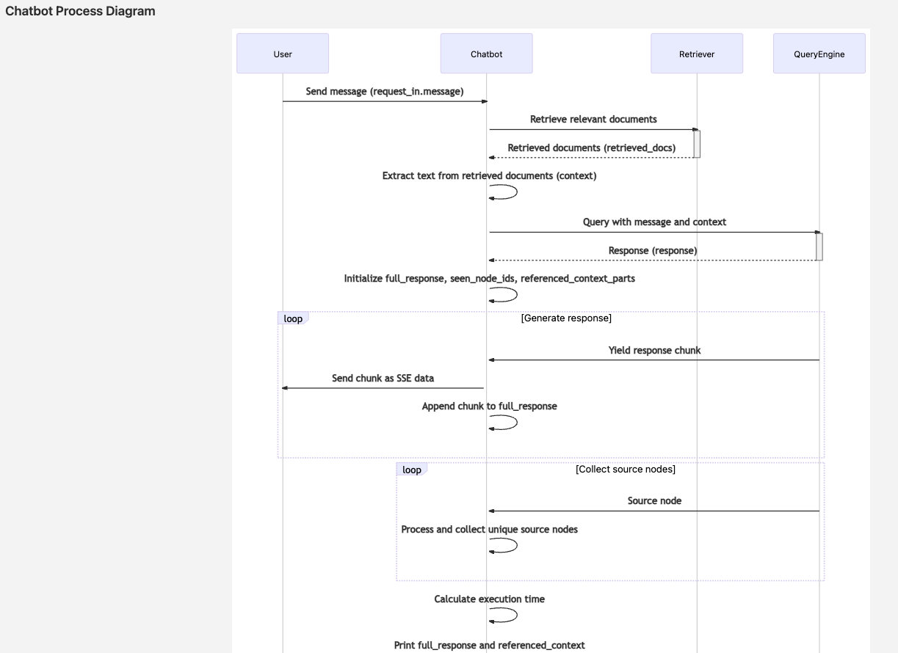

# Humana Chatbot Tech Document

#### By: Dingchao Zhang

This technical documentation provides a comprehensive overview of the preprocessing, dataset generation, evaluation, and implementation processes used in the humana healthcare project. The primary objective is to build a robust Retrieval-Augmented Generation (RAG) system and an efficient vector database for information retrieval based on the paper.

This project integrates advanced AI, data processing, and scalable infrastructure to build a robust RAG chatbot for healthcare.

Data Processing: Extracts and preprocesses text from PDFs using Llamaindex SimpleDirectoryReader, PaddleOCR, and BLIP for multimodal handling.

RAG System: Uses Llamaindex, Deepseek R3, HuggingFaceEmbedding, VectorStoreIndex, and a query engine for intelligent retrieval and response generation.

Backend & API: Built with FastAPI, implementing CRUD operations and streaming responses via SSE.

Evaluation & Monitoring: Measures performance with sythentic test dataste generated with MRR, Hit Rate, NDCG, and real-time user feedback mechanisms.

## **Setup and Execution Guide**

### 1. Synchronize Dependencies

Run the following command to sync project dependencies:

```bash
uv sync
```

### 2. Activate Virtual Environment

Activate the virtual environment to ensure dependencies are installed correctly:

```bash
source .venv/bin/activate
```

### 3. Configure Environment Variables

Edit the `.env` file to set necessary environment variables following the .env-example:

```bash
vim .env
```

### 4. Start Local Database

Run the local database using Docker Compose:

```bash
docker compose -f docker-compose.local.yaml up -d
```

### 5. Preprocess Database

Execute the preprocessing script to prepare the database:

```bash
bash ./scripts/prestart.sh
```

### 6. Preprocess PDF Files

Run the preprocessing script for handling PDF files:

```bash
python preprocess/preprocess.py

```

### 7. Start FastAPI Application

Launch the FastAPI application with hot-reloading enabled:

```bash
fastapi run --reload app/main.py
```

Then go to http://0.0.0.0:8000/docs to see the back end API


User can create a chat room:


Then ask question


Get response in streaming


Then clone this repo https://github.com/dingchaoz/chatbot-frontend , follow the readme to use pnpm for installation, then go to http://localhost:5173/chat
to start chatting, and user can provide feedback which helps evaluation of the performance, and we see retrieved contexts
are also provided to user:


Go to http://localhost:5173/dashboard to see online feedback


# Chatbot Healthcare Project: Technical Documentation

## Preprocessing: Data Preparation

Before building the chatbot, the data must be cleaned, structured, and transformed into a format suitable for retrieval and indexing.

### Preprocessing Script (`preprocess.py`)


#### Purpose

This script reads, cleans, and processes text data from PDFs, ensuring it is in an optimal format for building a vector database and index.

#### Key Components

1. **Reading and Cleaning Data**

   - Uses `SimpleDirectoryReader` to read PDFs.
   - Cleans text by removing unnecessary characters and formatting inconsistencies.
2. **Semantic Splitting and Node Parsing**

   - Utilizes `SemanticSplitterNodeParser` to segment text into meaningful nodes.
   - Employs `HuggingFaceEmbedding` to generate embeddings for nodes.
3. **Creating Vector Store Index**

   - Constructs a `VectorStoreIndex` using parsed nodes and embeddings.
   - Enables efficient retrieval of relevant information.
4. **Saving Artifacts**

   - Stores processed data, including the index and language models, for future querying and evaluation.

### Graph Processing Script (`graphs_process.py`)

#### Purpose

Extracts text and images from PDFs using OCR and image captioning models to handle multimodal data.

#### Key Components

1. **OCR and Image Captioning**

   - Uses `PaddleOCR` for text extraction from images.
   - Employs `BLIP` (BlipProcessor & BlipForConditionalGeneration) for image captioning.
2. **Extracting Content**

   - Retrieves text and images from PDF pages.
   - Ensures comprehensive content capture for indexing.

#### Considerations

- **Multimodal Data Handling**: Captures both text and images for accurate information retrieval.
- **Model Performance**: Uses state-of-the-art models for reliable results.
- **Integration**: Seamlessly integrates into the preprocessing pipeline.

## Retrieval-Augmented Generation (RAG) System: Building the Chatbot

Once the data is preprocessed, the chatbot is built using a RAG system to enable intelligent retrieval and response generation.

### RAG System (`chatrooms.py`)



#### Purpose

Enhances chatbot responses by retrieving relevant indexed data and integrating it into response generation.

#### Key Components

1. **Retriever and Query Engine**

   - Uses a retriever to search the vector database.
   - Employs a query engine to generate responses based on retrieved documents.
2. **Retrieving Relevant Information**

   - Searches the database for documents matching user queries.
   - Extracts and combines relevant text to form a query context.
3. **Generating Responses**

   - Generates responses in real time, providing updates via Server-Sent Events (SSE).
4. **Handling Source Nodes**

   - Collects and references source nodes for contextual accuracy.

#### Considerations

- **Efficiency**: Optimized for fast retrieval and response generation.
- **Accuracy**: Ensures contextually relevant responses.
- **Real-Time Updates**: Provides an interactive user experience.

## API Endpoints: Backend Interface Design

To integrate the chatbot into an application, backend API endpoints are implemented to manage chatrooms, messages, and chatbot interactions.

### API Implementation in `chatrooms.py`

#### Key Functionalities

1. **Retrieve Chatrooms** (`GET /chatrooms`)
   - Fetches chatrooms with pagination.
2. **Create Chatroom** (`POST /chatrooms`)
   - Creates a new chatroom.
3. **Retrieve Messages with Comments** (`GET /chatrooms/messages/comments`)
   - Fetches messages containing comments with pagination.
4. **Upsert Comment on Message** (`POST /chatrooms/messages/{message_id}/comments`)
   - Updates comments if the sender is 'ASSISTANT'.
5. **Chat in Chatroom** (`POST /chatrooms/{chatroom_id}/chat`)
   - Processes chat messages using the RAG system and streams responses.
6. **Delete Chatroom** (`DELETE /chatrooms/{chatroom_id}`)
   - Deletes a chatroom and associated messages.
7. **Retrieve Messages by Chatroom** (`GET /chatrooms/{chatroom_id}/messages`)
   - Fetches messages for a specified chatroom with pagination.

### How the Chatbot Works

1. **Message Processing**: Uses a retriever to gather relevant information and a query engine to generate responses.
2. **Streaming Response**: Sends responses in chunks for real-time updates.
3. **Context Management**: Maintains reference to previous messages for continuity.
4. **CRUD Operations**: Ensures data integrity in chatroom management.

## Dataset Generation, Evaluation, and Display: Post-Evaluation

After the chatbot is built, the dataset is generated, and performance is evaluated to ensure high-quality retrieval and response accuracy.


### Dataset Generation (`generate_dataset.py`)

#### Purpose

Creates a dataset by processing extracted and structured data, generating embeddings, and storing data for retrieval. Future work includes expanding evaluation methodologies with both **offline** and **online** approaches.

- **Offline Evaluation**: Uses pre-collected datasets to assess performance based on retrieval accuracy and ranking quality. Additional metrics to consider:

  - **F1 Score**: Balances precision and recall to measure overall retrieval performance.
  - **Semantic Similarity Score**: Evaluates how closely retrieved results match the intended query using embedding-based comparisons.
  - **Diversity Score**: Ensures that retrieved documents are varied and provide a broad set of relevant results.
- **Online Evaluation**: Conducts real-time evaluations based on live user interactions. Future improvements include:

  - **User Feedback Integration**: Capturing explicit user ratings or implicit signals (e.g., response click-through rates, message engagement levels).
  - **A/B Testing**: Comparing different retrieval strategies to measure performance in live environments.
  - **Latency and Throughput Metrics**: Monitoring system efficiency to ensure fast and scalable retrieval.

To implement these improvements, additional systems such as **logging pipelines**, **real-time monitoring dashboards**, and **feedback loops for active learning** will be incorporated to enhance continuous evaluation and system refinement.

### Evaluation and Display (`evaluate_and_display_results.py`)

#### Purpose

Evaluates retrieval performance using key metrics and visualizes results to ensure the effectiveness of the RAG system.

### Metrics Selection

Key metrics for evaluating retrieval performance:

1. **Hit Rate**: Measures the proportion of queries retrieving at least one relevant document.
2. **Mean Reciprocal Rank (MRR)**: Evaluates the ranking position of the first relevant document.
3. **Precision**: Assesses the proportion of retrieved documents that are relevant.
4. **Recall**: Measures the proportion of relevant documents successfully retrieved.
5. **Average Precision (AP)**: Combines precision and recall to provide an overall retrieval assessment.
6. **Normalized Discounted Cumulative Gain (NDCG)**: Weighs ranking quality, giving more importance to highly relevant documents appearing early.

LlamaIndex is used to generate a synthetic test dataset containing queries, ground truth, context, and other relevant data. Each query’s response and retrieval performance are evaluated using predefined metrics. For evaluation results, refer to evaluations/llamaindextestset.csv.

following is one of the test:

('query', '**Question 1:** In the study by Slamon et al. (1987), what specific oncogene was found to correlate with relapse and survival in human breast cancer, and what was the significance of its amplification?')

('expected_ids', ['b26198e3-9070-4c1a-ad96-31a524d27dd4'])

('retrieved_ids', ['b26198e3-9070-4c1a-ad96-31a524d27dd4', '527724bb-c508-49d3-8da4-6c0d231f63a7', 'd9e088f6-7337-402d-97d8-8a516e0a4175', '65dafcb0-4d22-4fe0-8b1e-62a475adf0d6', '93fa4ef5-7026-4041-b5e1-619f2e88904b'])

('retrieved_texts', [
    'See discussions, stats, and author profiles for this publication at: https://www.researchgate.net/publication/19364043\nSlamon DJ, Clark GM, Wong SG, Levin WJ, Ullrich A, McGuire WLHuman breast\ncancer: correlation of relapse and survival with amplification of the HER-2/neu\noncogene. Science (Wash DC...\nArticle\xa0\xa0in \xa0\xa0Science · February 1987\nDOI: 10.1126/science.3798106\xa0·\xa0Source: PubMed\nCITATIONS\n9,964\nREADS\n28,987\n6 authors, including:\nGary Clark\nGary Clark Statistical Consulting, LLC\n363 PUBLICATIONS\xa0\xa0\xa069,736 CITATIONS\xa0\xa0\xa0\nSEE PROFILE\nSteven G Wong\nUniversity of California, Los Angeles\n24 PUBLICATIONS\xa0\xa0\xa024,943 CITATIONS\xa0\xa0\xa0\nSEE PROFILE\nWendy Levin\nFate Therapeutics, Inc.\n25 PUBLICATIONS\xa0\xa0\xa017,944 CITATIONS\xa0\xa0\xa0\nSEE PROFILE\nAll content following this page was uploaded by Gary Clark on 23 December 2013.\n',
    'The title SCIENCE is a \nCopyrightAmerican Association for the Advancement of Science, 1200 New York Avenue NW, Washington, DC 20005. \nScience (print ISSN 0036-8075; online ISSN 1095-9203) is published weekly, except the last week in December, by the\n on January 15, 2007 www.sciencemag.orgDownloaded from \nBIOM 255 (Leffert) – Discussion Feb. 1, 2007',
    '0 0.6-\n00.\nOX 0.4-\n` 0.2-\namplified(n=52)\nAmplified(n=34)\nA\nNotamplified(n=52)\nAmplified(n=34)\nB\n12 24 36 48 60 72 84\nNotamplified(n=52)\nAmplified(n=11)\n>5copies\nC\nNotamplified(n=52)\nAmplified(n=11)\n>5copies\nD\n12 24 36 48 60 72 84\nTime(months)\nARTICLES 179\n on January 15, 2007 www.sciencemag.orgDownloaded from \nBIOM 255 (Leffert) – Discussion Feb. 1, 2007',
    'ARTICLES177\n on January 15, 2007 www.sciencemag.orgDownloaded from \nBIOM 255 (Leffert) – Discussion Feb. 1, 2007',
    'SCIENCE,VOL.235\n on January 15, 2007 www.sciencemag.orgDownloaded from \nBIOM 255 (Leffert) – Discussion Feb. 1, 2007\nView publication stats'
])

('metric_dict', {
    'hit_rate': RetrievalMetricResult(score=1.0, metadata={}),
    'mrr': RetrievalMetricResult(score=1.0, metadata={}),
    'precision': RetrievalMetricResult(score=0.2, metadata={}),
    'recall': RetrievalMetricResult(score=1.0, metadata={}),
    'ap': RetrievalMetricResult(score=1.0, metadata={}),
    'ndcg': RetrievalMetricResult(score=1.0, metadata={})
})
