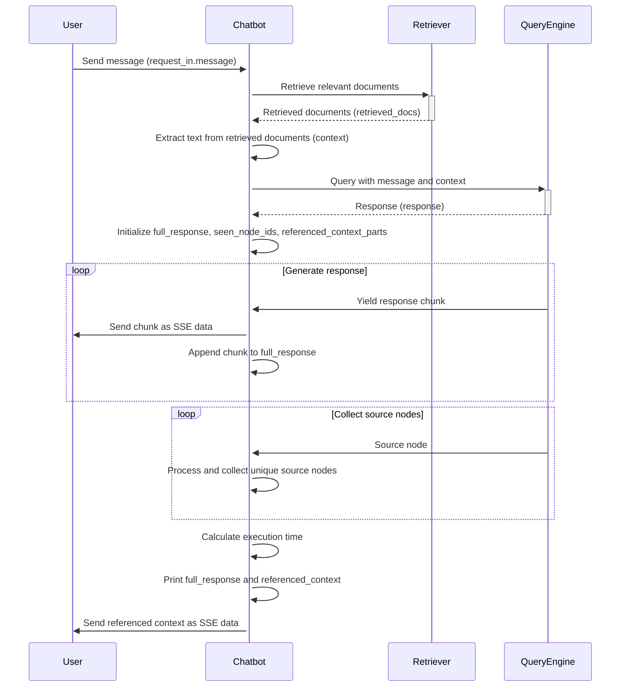

# Chatbot Process Diagram

```mermaid
sequenceDiagram
    participant User
    participant Chatbot
    participant Retriever
    participant QueryEngine

    User->>+Chatbot: Send message (request_in.message)
    Chatbot->>+Retriever: Retrieve relevant documents
    Retriever-->>-Chatbot: Retrieved documents (retrieved_docs)
    Chatbot->>Chatbot: Extract text from retrieved documents (context)
    Chatbot->>+QueryEngine: Query with message and context
    QueryEngine-->>-Chatbot: Response (response)

    Chatbot->>Chatbot: Initialize full_response, seen_node_ids, referenced_context_parts

    loop Generate response
        QueryEngine->>Chatbot: Yield response chunk
        Chatbot->>User: Send chunk as SSE data
        Chatbot->>Chatbot: Append chunk to full_response
    end

    loop Collect source nodes
        QueryEngine->>Chatbot: Source node
        Chatbot->>Chatbot: Process and collect unique source nodes
    end

    Chatbot->>Chatbot: Calculate execution time
    Chatbot->>Chatbot: Print full_response and referenced_context
    Chatbot->>User: Send referenced context as SSE data
```
