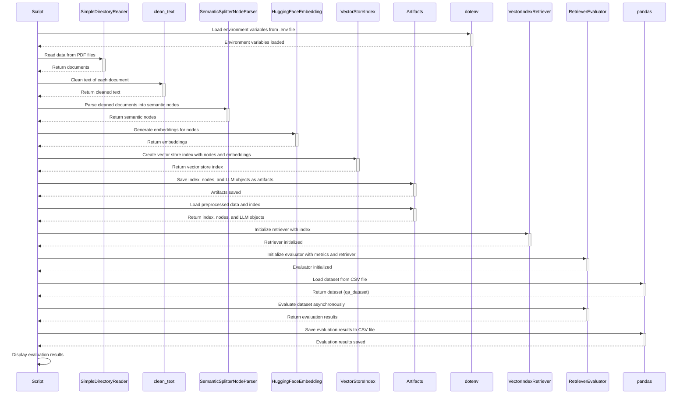

# Generate Dataset and Evaluate Results Diagram

```mermaid
sequenceDiagram
    participant Script
    participant PDFReader as SimpleDirectoryReader
    participant TextCleaner as clean_text
    participant NodeParser as SemanticSplitterNodeParser
    participant EmbeddingModel as HuggingFaceEmbedding
    participant VectorIndex as VectorStoreIndex
    participant FileSystem as Artifacts
    participant EnvLoader as dotenv
    participant Retriever as VectorIndexRetriever
    participant Evaluator as RetrieverEvaluator
    participant CSVReader as pandas

    Script->>+EnvLoader: Load environment variables from .env file
    EnvLoader-->>-Script: Environment variables loaded

    Script->>+PDFReader: Read data from PDF files
    PDFReader-->>-Script: Return documents
    Script->>+TextCleaner: Clean text of each document
    TextCleaner-->>-Script: Return cleaned text
    Script->>+NodeParser: Parse cleaned documents into semantic nodes
    NodeParser-->>-Script: Return semantic nodes
    Script->>+EmbeddingModel: Generate embeddings for nodes
    EmbeddingModel-->>-Script: Return embeddings
    Script->>+VectorIndex: Create vector store index with nodes and embeddings
    VectorIndex-->>-Script: Return vector store index
    Script->>+FileSystem: Save index, nodes, and LLM objects as artifacts
    FileSystem-->>-Script: Artifacts saved

    Script->>+FileSystem: Load preprocessed data and index
    FileSystem-->>-Script: Return index, nodes, and LLM objects
    Script->>+Retriever: Initialize retriever with index
    Retriever-->>-Script: Retriever initialized
    Script->>+Evaluator: Initialize evaluator with metrics and retriever
    Evaluator-->>-Script: Evaluator initialized

    Script->>+CSVReader: Load dataset from CSV file
    CSVReader-->>-Script: Return dataset (qa_dataset)

    Script->>+Evaluator: Evaluate dataset asynchronously
    Evaluator-->>-Script: Return evaluation results

    Script->>+CSVReader: Save evaluation results to CSV file
    CSVReader-->>-Script: Evaluation results saved

    Script->>Script: Display evaluation results
```
