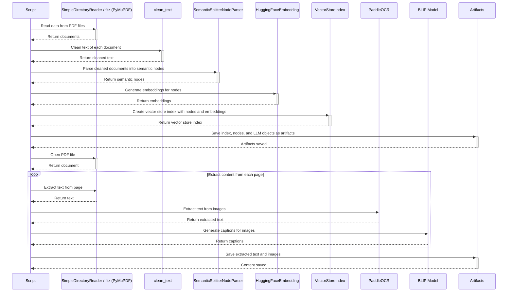

# Preprocessing and Graph Processing Script Diagram

```mermaid
sequenceDiagram
    participant Script
    participant PDFReader as SimpleDirectoryReader / fitz (PyMuPDF)
    participant TextCleaner as clean_text
    participant NodeParser as SemanticSplitterNodeParser
    participant EmbeddingModel as HuggingFaceEmbedding
    participant VectorIndex as VectorStoreIndex
    participant OCR as PaddleOCR
    participant ImageCaptioning as BLIP Model
    participant FileSystem as Artifacts

    Script->>+PDFReader: Read data from PDF files
    PDFReader-->>-Script: Return documents
    Script->>+TextCleaner: Clean text of each document
    TextCleaner-->>-Script: Return cleaned text
    Script->>+NodeParser: Parse cleaned documents into semantic nodes
    NodeParser-->>-Script: Return semantic nodes
    Script->>+EmbeddingModel: Generate embeddings for nodes
    EmbeddingModel-->>-Script: Return embeddings
    Script->>+VectorIndex: Create vector store index with nodes and embeddings
    VectorIndex-->>-Script: Return vector store index
    Script->>+FileSystem: Save index, nodes, and LLM objects as artifacts
    FileSystem-->>-Script: Artifacts saved

    Script->>+PDFReader: Open PDF file
    PDFReader-->>-Script: Return document
    loop Extract content from each page
        Script->>PDFReader: Extract text from page
        PDFReader-->>Script: Return text
        Script->>OCR: Extract text from images
        OCR-->>Script: Return extracted text
        Script->>ImageCaptioning: Generate captions for images
        ImageCaptioning-->>Script: Return captions
    end
    Script->>+FileSystem: Save extracted text and images
    FileSystem-->>-Script: Content saved
```
